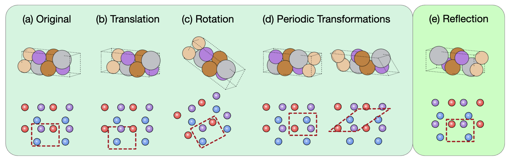
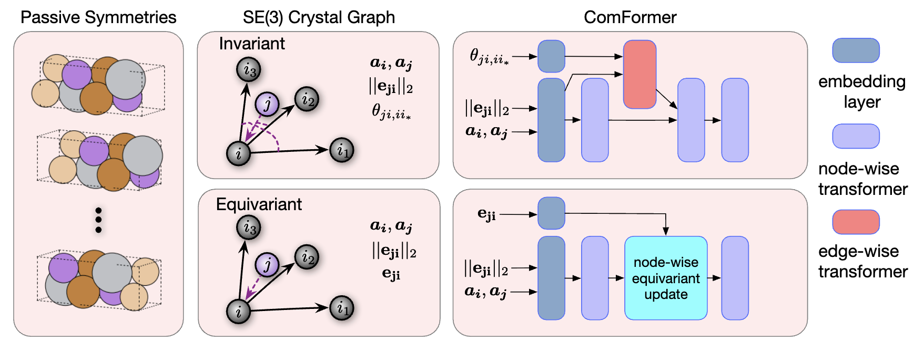
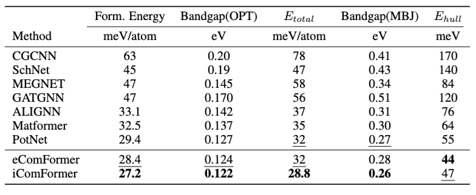
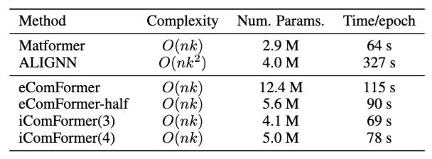
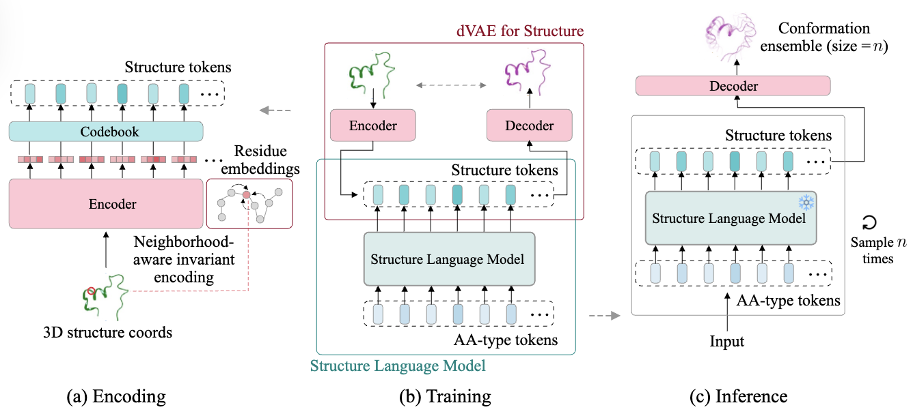
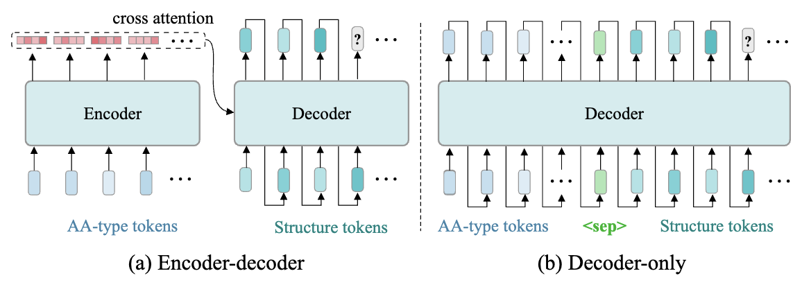
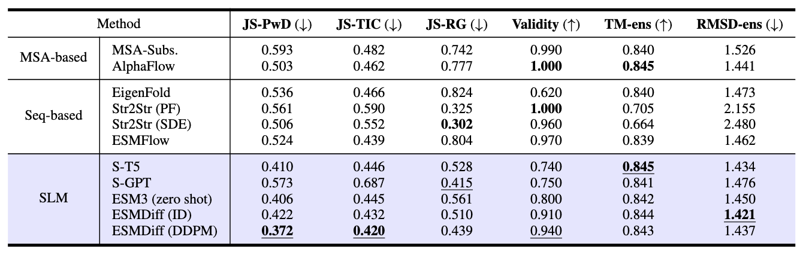
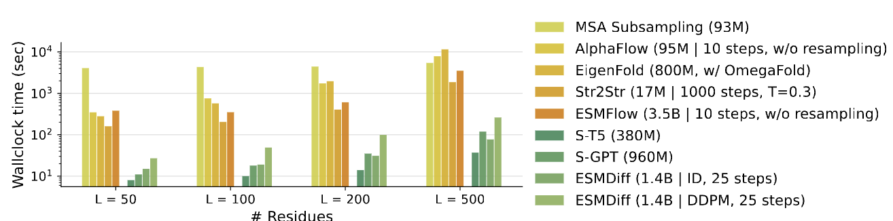

# AI810 Blog Post (20255126)
In this blog post, I reviewed the following two papers:
1. [Complete and Efficient Graph Transformers for Crystal Material Property Prediction (ICLR 2024)](https://openreview.net/forum?id=BnQY9XiRAS)
2. [Structure Language Models for Protein Conformation Generation (ICLR 2025)](https://openreview.net/forum?id=OzUNDnpQyd)

## [Review 1] Complete and Efficient Graph Transformers for Crystal Material Property Prediction
**Outline**

- [About this paper](#about-this-paper)
    - [Motivation](#motivation)
    - [Method](#method)
    - [Experiments](#experiments)
- [Review](#review)
    - [Strengths](#strengths)
    - [Weaknesses](#weaknesses)
    - [Comments](#comments)

### About this paper
In this article, I am going to review a paper : [Complete and Efficient Graph Transformers for Crystal Material Property Prediction (ICLR 2024)](https://openreview.net/forum?id=BnQY9XiRAS).
#### Motivation
Crystal structures are fundamentally different from molecules. They are periodic, infinite in space, and can exhibit chirality. These properties pose several challenges when applying geometric deep learning methods.

##### Why current methods fall short
Most crystal graph models approximate a crystal as a finite set of atoms within a single unit cell, and consider only local neighbors within a cutoff radius. However, this leads to two key problems:

**1. Geometric incompleteness**

Models like CGCNN ([Xie and Grossman, 2018](#1)), Matformer ([Guerrero et al., 2022](#2)), and others often treat different crystal structures as identical if they share local neighborhoods, even if their global structures differ. This can result in predicting the same properties for crystals that are actually very different.

**2. Failure to handle symmetries**

*Figure 1: This figure illustrates different types of transformations applied to a crystal structure and their effects on how the crystal appears in both 3D space (top row) and its corresponding 2D lattice representation (bottom row).*

Crystal structures have multiple symmetries:

* **Translation**: The red dashed unit cell is shifted, but the internal configuration of atoms and their neighbors is preserved. This shows that a translation does not change the intrinsic geometry of the crystal. Only the origin of the coordinate system changes.

* **Rotation**: The lattice is rotated, and so is the unit cell boundary. This transformation should preserve atomic distances and angles within the unit cell.

* **Periodic transformations**: The red dashed unit cell is redefined using the periodicity of the lattice. Even though the atom positions appear to change, they are equivalent due to periodic boundary conditions.

* **Reflection**: The structure is mirrored. This changes the chirality (handedness) of the molecule or crystal. The reflection does not preserve the same 3D structure if the original structure is chiral.

Translation, rotation, and periodic transformations do not change the crystal structure and are considered passive symmetries. In contrast, if a crystal lacks reflection symmetry, applying a reflection will produce its chiral (mirror) image.

##### The goal
The authors aim to design crystal representations and neural networks that are:

* Geometrically complete (can distinguish any two different crystals)

* Symmetry-aware (respect crystal-specific invariances)

* Scalable and efficient (practical for large-scale datasets)

#### Method
The core idea is to construct crystal graphs that are provably complete and symmetry-aware, and then feed them into a transformer architecture designed for this structure.

##### 1. Preliminaries
###### What is a crystal structure?
A crystal structure is defined by:

* Atom types: Feature matrix  $A=[a_1,\ldots,a_n]\in\mathbb{R}^{d_a\times n}$

* 3D positions: $P = [p_1, \ldots, p_n] \in \mathbb{R}^{3 \times n}$

* Lattice matrix: $L = [\ell_1, \ell_2, \ell_3] \in \mathbb{R}^{3 \times 3}$

The full crystal extends infinitely via lattice translations:
* Positions: $\hat{P} = { p_i + k_1 \ell_1 + k_2 \ell_2 + k_3 \ell_3 \mid k_1, k_2, k_3 \in \mathbb{Z}, 1 \le i \le n }$

* Features: $\hat{A} = { a_i \mid 1 \le i \le n }$

The learning task is to predict a property $y$ (either regression or classification) from $(A, P, L)$.

###### What is geometric completeness?
A crystal graph is geometrically complete if two crystals that have different atomic arrangements always yield different graph representations. In other words, a crystal graph $G$ is geometrically complete if $G_1=G_2\rightarrow M_1\cong M_2$, where $\cong$ denotes that two crystals are isometric. In other words, if two crystals $M_1$ and $M_2$ have the same graph representation $G_1 = G_2$, then they must be isometric ($M_1 \cong M_2$). It means that if the graphs are the same, the underlying crystals must be the same too.

###### What symmetries must be preserved?
SE(3) Invariance: A crystal graph representation is $SE(3)$ invariant if, for any rotation transformation $R\in \mathbb{R}^{3\times 3}, |R|=1$ and transformation $b\in\mathbb{R}^3$, the crystal graph remains the same, $f(A, P, L) = f(A, RP + b, RL)$.

SO(3) Equivariance: A crystal graph represent is $SO(3)$ equivariant if, for any rotation transformation $R\in\mathbb{R}^{3\times 3}, |R|=1$ and translation transformation $b\in \mathbb{R}^3$, the crystal graph rotates accordingly, $
f(A, RP + b, RL) = R f(A, P, L)$.

Periodic Invariance: Representations must be invariant to the choice of valid unit cell. If two unit cell descriptions $(A, P, L)$ and $(A', P', L')$ represent the same crystal, then $f(A, P, L) = f(A', P', L')$.

These ensure consistent representation across different crystal encodings.

##### 2. Proposed Graph Representations
The authors propose two types of crystal graphs that are provably geometrically complete.

*Figure 2: Overview of the ComFormer pipeline. Left: Different unit cells of the same crystal due to passive symmetries. Middle: SE(3)-invariant graphs use distances and angles; SE(3)-equivariant graphs use edge vectors. Right: iComFormer (top) processes invariant graphs with scalar features; eComFormer (bottom) handles equivariant graphs with vector features and equivariant updates.*

###### A. SE(3)-Invariant Crystal Graphs (for iComFormer)
Each node in the graph represents an atom and all its infinite periodic images.

**Edge Construction**
* Each node $i$ represents an atom in the crystal. For each neighbor node $j$, and its periodic image $j'$, the edge is constructed if $| p_{j'} - p_i |_2 \le r$ where $r$ is a cutoff radius and $p_i$ is the position of atom $i$.

* Each edge is represented by the scalar-valued features:
$$[\lvert\lvert e_{j'i}\rvert\rvert _2\theta_{j'i,i_1}, \theta_{j'i,i_2}, \theta_{j',i,i_3}]$$

where 
* $\lvert\lvert e_{j'i}\rvert \rvert _2$ is the Euclidean distance between atoms $i$ and $j'$

* \theta_{j'i,i_k} is the angle between e_{j'i} and reference directions defined by the three nearest periodic duplicates $i_1$, $i_2$, $i_3$ of atom $i$.

**Lattice Basis Construction**
To define local periodic directions at each node:

* Choose three nearest periodic duplicates of atom $i$: $i_1$, $i_2$, $i_3$

* Ensure they form a right-handed orthogonal basis:
${ e_{ii_1}, e_{ii_2}, e_{ii_3} }$

* Normalize and flip directions to maintain consistency and chirality awareness

This graph construction guarantees invariance to all crystal symmetries (SE(3) + periodic invariance), and can distinguish chiral crystals.

###### B. SO(3)-Equivariant Crystal Graphs (for eComFormer)
This variant uses vector-valued edge features instead of scalar angles.

* Edge feature: $e_{j'i} = p_{j'} - p_i \in \mathbb{R}^3$

This edge vector transforms equivariantly under global $SE(3)$ operations (such as rotation), allowing the model to preserve $SO(3)$ equivariance and remain geometrically complete.

##### 3. Network Architecture: ComFormer
The crystal graphs above are used as input to a novel transformer called ComFormer (Complete Graph Transformer for Crystals), which has two variants:

* **iComFormer**: Built upon the $SE(3)$-invariant crystal graph. It uses scalar edge features, including distances and angular relations, and processes them through a node-wise transformer combined with an edge-wise transformer.

* **eComFormer**: Built upon the $SE(3)$-equivariant crystal graph. It uses vector edge features and includes a node-wise equivariant update module that respects directional transformations.

Each ComFormer layer updates atom-level embeddings using attention over neighbors, respecting the symmetry of the underlying graph. Both variants scale as $\mathcal{O}(nk)$, where $n$ is number of atoms and $k$ is average neighbors.

##### 4. Theoretical Guarantees
The authors prove that:

* Both graph constructions are geometrically complete

* The representations are symmetry-consistent (SE(3) or SO(3))

* The resulting graphs uniquely determine the infinite crystal

Proofs use mathematical induction and formal symmetry analysis.

#### Experiments
##### Benchmarks
Evaluated on:

1. JARVIS

2. Materials Project (MP)

3. MatBench

*Table1: Comparison on JARVIS*

[**Table 1**](#table1) compares Mean Absolute Error (MAE) across six different material property prediction tasks on the JARVIS dataset. To summarize:
* iComFormer achieves the lowest MAE on 4 out of 5 properties.

* eComFormer performs second best in many tasks, slightly behind iComFormer.

* Both variants outperform strong baselines like MatFormer and ALIGNN.

*Table2: Efficiency analysis*

[**Table 2**](#table2) compares the computational efficiency and parameter counts of ComFormer variants against baselines. To summarize:
* ALIGNN is the slowest (327 s/epoch) due to its higher complexity $O(nk^2)$.

* iComFormer(3) and iComFormer(4) have relatively small model sizes (4.1M and 5.0M params) compared to eComFormer (12.4M).
    * iComFormer(3) uses 3 reference neighbors to compute 3 angular features $\theta_{ji,i_1}, \theta_{ji,i_2}, \theta_{ji,i_3}$.
    * iComFormer(4) uses 4 reference neighbors, introducing an additional angular feature.

* eComFormer-half provides a lightweight alternative (5.6M params) while maintaining better performance than most baselines.

* All ComFormer variants maintain linear complexity $O(nk)$ making them more scalable than ALIGNN while achieving better accuracy.

##### Conclusion

This work provides a breakthrough in representing crystal structures for deep learning. It achieves:

* Geometric completeness: every crystal is uniquely represented

* Symmetry awareness: invariance/equivariance under SE(3), SO(3), and periodicity

* Efficiency and scalability: linear time complexity

* State-of-the-art performance: across multiple datasets

### Review
#### Strengths
##### 1. Clear and important motivation 
The paper tackles a fundamental and unresolved challenge in materials informatics: how to represent crystal structures completely and accurately for machine learning models. The authors clearly articulate the limitations of existing methods and explain why capturing periodicity, chirality, and symmetry is essential. This positions the work as both timely and impactful.

##### 2. Theoretical soundness
One of the major contributions of the paper is the proof of geometric completeness. The proposed representations ensure that no two distinct crystal structures are mapped to the same graph, which is a non-trivial and highly valuable property. The authors also prove that their models are symmetry-consistent, accounting for SE(3) invariance, SO(3) equivariance, and periodic invariance.

##### 3. Novel and well-justified graph construction
The crystal graph constructions are highly original. The SE(3)-invariant variant uses carefully selected periodic duplicates to construct a consistent lattice representation. The SO(3)-equivariant variant encodes vector-based features, supporting directional reasoning. These choices are well motivated and technically justified.

##### 4. Practical performance
Despite the theoretical focus, the proposed ComFormer models achieve state-of-the-art results on multiple crystal property prediction tasks. This includes regression and classification benchmarks from well-known datasets like Materials Project and MatBench. The experiments are thorough and use appropriate metrics.

##### 5. Scalability
Both iComFormer and eComFormer scale linearly with the number of atoms and neighbors in a unit cell. This is a practical advantage over other methods that become computationally intensive on large crystals.

#### Weaknesses

##### 1. No direct test of geometric completeness
Although the authors define and prove geometric completeness, they do not provide experiments that directly test this property. For example, it would be useful to show how the model performs on crystals with small perturbations, near-duplicate structures, or noisy data. These tests would provide direct evidence that the representation behaves as expected in practice.

##### 2. Lack of comparison to recent geometric deep learning models
The baselines used are mostly from earlier works (e.g., CGCNN ([Xie and Grossman, 2018](#1)), SchNet, Matformer ([Guerrero et al., 2022](#2))). The paper would be strengthened by including comparisons to recent equivariant models such as NequIP, E(3)NN, or TorchMD-NET, which are also capable of processing periodic structures with high accuracy.

##### 3. Minimal analysis on model generalization
Although the method is designed to be robust under symmetry transformations and different cell sizes, the authors do not present specific generalization experiments. For example, how well does ComFormer perform on unseen crystal classes, chiral structures, or crystals with varying degrees of disorder?

#### Comments
This is an excellent and well-rounded paper that combines theoretical rigor with practical impact. The authors address a long-standing gap in the field of crystal representation learning by introducing crystal graphs that are both geometrically complete and symmetry-consistent. These advances are backed by formal proofs and real-world benchmarks.

The main contribution lies not just in proposing a better transformer architecture, but in redefining how crystal structures should be represented for machine learning tasks. The introduction of ComFormer is thoughtful and the performance results are strong.

However, the paper could benefit from more architectural transparency, stronger comparative baselines, and further empirical validation of generalization and robustness. These limitations are relatively minor and do not detract from the significance of the work.

---

## [Review 2] Structure Language Models for Protein Conformation Generation
**Outline**

- [About this paper](#about-this-paper-2)
    - [Motivation](#motivation-2)
    - [Method](#method-2)
    - [Experiments](#experiments-2)
- [Review](#review-2)
    - [Strengths](#strength-2)
    - [Weaknesses](#weaknesses-2)
    - [Comments](#comments-2)

### About this paper
In this article, I am going to review a paper : [Structure Language Models for Protein Conformation Generation (ICLR 2025)](https://openreview.net/forum?id=OzUNDnpQyd).
#### Motivation
Understanding how proteins fold into their three-dimensional structure is important for many applications in biology and drug discovery. Traditional models for generating protein structures often rely on autoregressive decoding or diffusion-based sampling. These approaches are slow and computationally expensive. They also make it difficult to interpret or control the structure generation process.

Most existing methods directly predict atomic positions in space. However, these Cartesian coordinates do not reflect the natural structure of proteins. In real proteins, the backbone geometry is mostly determined by a small number of rotation angles, called torsion angles.

This paper introduces a new approach to protein structure generation. The key idea is to treat the generation of protein structures as a language modeling problem. Instead of predicting atomic coordinates, the model predicts torsion angles that define the protein’s backbone. This is done using a non-autoregressive structure language model.

#### Method
##### Representing Protein Structures
Proteins are represented using their torsion angles, specifically the backbone angles known as phi, psi, and omega. These angles control the relative orientation of atoms in the protein chain. By using only torsion angles, the model reduces the problem to predicting a short sequence of interpretable values for each residue.

Each residue in a protein is represented by a triplet of torsion angles:

* $\phi$ (phi): The angle of rotation around the bond between the nitrogen atom (N) and the alpha carbon atom (Cα). It determines how the previous residue connects to the current one.

* $\psi$ (psi): The angle of rotation around the bond between the alpha carbon atom (Cα) and the carbonyl carbon atom (C). It affects the orientation of the current residue with respect to the next one.

* $\omega$ (omega): The angle of rotation around the peptide bond between the carbonyl carbon (C) of the current residue and the nitrogen (N) of the next residue.
This angle is typically close to 180 degrees (trans configuration), but in rare cases it can be 0 degrees (cis configuration).

For the figurative explanation of this triplet, refer this [link](http://www.bioinf.org.uk/teaching/bioc0008/pepdihed.gif).

These three angles are sufficient to define the backbone structure of a protein when combined with known bond lengths and bond angles.

*Figure 3: Overview of the SLM framework.*

##### Discretizing 3D space
Protein structures exist in continuous 3D space, but directly modeling them is computationally expensive and geometrically complex. To address this, the paper proposes transforming 3D structures into sequences of discrete latent tokens using a discrete variational autoencoder (dVAE). These tokens:

* Are invariant to global rotations and translations

* Encode local structure efficiently

* Enable the use of sequence-based language models for generation and inference

The discretization process consists of two stages using a dVAE.

**Stage 1. Learning the latent structure tokens**
This stage learns how to map a continuous structure into a discrete representation. Its process is illustrated at [**Figure 3 (a)**](#figure-slm-framework).

Given a protein structure with backbone 3D coordinates $x \in \mathbb{R}^{L \times 3}$, where $L$ is the number of residues, the goal is to convert this continuous representation into a discrete sequence of structure tokens $z = (z_1, z_2, \ldots, z_L)$, where each $z_i \in \mathcal{V}$, a learned codebook of token types. 

To achieve this, the authors introduce a discrete variational autoencoder (dVAE) that consists of: 

* Encoder $q_\psi(z \mid x)$: Takes the 3D structure $x$ and computes local neighborhood-aware invariant residue embeddings, which are then quantized into discrete tokens using a codebook.

* Codebook $\mathcal{V}$: A fixed set of learned vectors used to discretize continuous embeddings into structure tokens. 

* Decoder $p_\phi(x \mid z, c)$: Reconstructs the 3D structure $x$ from the token sequence $z$ and the amino acid sequence $c = (c_1, \ldots, c_L) \in \mathcal{A}^L$, where $\mathcal{A}$ is the amino acid vocabulary. This stage is trained using the following variational lower bound (ELBO):

  $$
  \log p(x \mid c) \geq \mathbb{E}_{z \sim q(z \mid x)} \left[ \log p(x \mid z, c) \right] - D_{\mathrm{KL}} \left( q(z \mid x) \parallel p(z \mid c) \right)
  $$

* During this stage, the prior $p(z \mid c)$ is fixed, often set to a uniform distribution.

**Stage 2: Learning the prior over tokens**
Once the dVAE is trained, its encoder and decoder are frozen. The next goal, illustrated at [**Figure3 (b)**](#figure-slm-framework), is to model the conditional distribution over structure tokens given the amino acid sequence, denoted: 
$$p_\theta(z \mid c)$$

This is implemented with a Structure Language Model trained to predict the structure token sequence $z$ from the input AA-type sequence $c$, using cross-entropy loss over the predicted tokens. This training process is visualized in Figure 2(b).

At training time, the model is trained on pairs $(c, z)$ generated from known protein structures and their corresponding tokenizations from the encoder $q_\psi(z \mid x)$.

**Inference: Structure generation and inference**
At inference time, the trained structure language model is used to sample structure token sequences:

Input: AA-type token sequence $c$

Output: A sampled structure token sequence $z \sim p_\theta(z \mid c)$

This step is shown in Figure 2(c). The model can sample multiple conformations by drawing $n$ samples from $p_\theta(z \mid c)$, generating a conformational ensemble of size $n$.

Each sampled token sequence $z^{(j)}$ is passed through the pretrained decoder $p_\phi(x \mid z, c)$ to reconstruct the corresponding 3D backbone structure $x^{(j)}$.

*Figure 4: Model architecture and structure token generation process.*

##### Model Architecture and Objective
To model the conditional distribution of structure tokens given the amino acid sequence, denoted as $p_\theta(z \mid c)$, the paper explores two transformer-based architectures: the encoder-decoder and the decoder-only variants, as shown in [**Figure4**](#figure-autoregressive-prior-modeling).

(a) Encoder–Decoder Architecture 

As illustrated in [**Figure4 (a)**](#figure-autoregressive-prior-modeling):

* Input: A sequence of amino acid tokens $c = (c_1, \ldots, c_L) \in \mathcal{A}^L$

* The encoder processes $c$ to produce contextual embeddings.

* The decoder autoregressively generates the structure tokens $z = (z_1, \ldots, z_L) \in \mathcal{V}^L$, attending to the encoder output via cross-attention.

* The model factorizes the probability as:
    $$
    p_\theta(z|c)=\prod^L_{i=1}p_\theta(z_i|z_{<i},c)
    $$

(b) Decoder-Only Architecture

As illustrated in [**Figure4 (b)**](#figure-autoregressive-prior-modeling):

* The model concatenates the amino acid tokens and a separator token $\texttt{<sep>}$ with the structure tokens as a single sequence:
    $$
    x=(c_1,\ldots,c_L\text{<sep>},z_1,\ldots,z_L)
    $$

* The decoder is trained autoregressively to predict each token from the previous ones:
    $$
    p_\theta(z|c)=\prod^L_{i=1}p_\theta(z_i|c,z_{<i})
    $$

The training objective is based on masked language modeling. A random subset of torsion angle tokens is masked, and the model is trained to predict them using the unmasked context. Let $x$ be the input context and $y = (y_1, \ldots, y_n)$ be the true torsion tokens. Let $M$ be the set of masked positions. The loss function is:
$$
\mathcal{L}_{\text{MLM}}=-\sum_{i\in M}\log p(y_i|x,y_{[n]\\ M})
$$
This allows the model to learn dependencies between different parts of the protein structure while supporting efficient parallel inference.

##### Non-Autoregressive Generation
Traditional sequence models generate tokens one at a time. This is slow and limits parallelism. The structure language model uses a non-autoregressive formulation. It assumes that all torsion angle tokens can be generated independently given the input sequence:
$$
p(y)=\prod_{i=1}^n p(y_i|x)
$$
This allows the model to generate full structures in a single step, making it much faster than autoregressive or diffusion-based approaches.

##### Structure Reconstruction
After predicting the structure tokens $z = (z_1, \ldots, z_L)$, each token $z_i \in \mathcal{V}$ is mapped to a corresponding torsion angle triplet $(\phi_i, \psi_i, \omega_i)$ using a cluster center lookup. These angles, combined with known bond lengths and bond angles, are used to reconstruct the full 3D protein backbone geometry through deterministic geometric rules. This reconstruction process does not require any additional learned parameters.

#### Experiments
The model is evaluated on several datasets including ProteinNet and CATH. It is tested on two main tasks: structure recovery and structure generation. In this blog post, I am going to introduce the result of BPTI conformation generation task.

##### BPTI conformation generation

*Table3: BPTI results*

[**Table 3**](#table3) compares the performance of various conformation generation models on the BPTI (Bovine Pancreatic Trypsin Inhibitor) benchmark. The task is to generate realistic protein structures that match a reference ensemble obtained from molecular dynamics (MD) simulations.

The models are categorized into:

* MSA-based methods: Leverage multiple sequence alignments (e.g., AlphaFlow, MSA-Subs.)

* Sequence-based methods: Use only amino acid sequences (e.g., EigenFold, ESMFlow, Str2Str)

* SLM-based methods: Structure Language Models using discrete structure token representations (e.g., ESMDiff, ESM3)

As a result, ESMDiff (DDPM) achieves the lowest JS-PwD (0.372) and JS-TIC (0.420), indicating the generated structures closely resemble the geometric and dynamic distributions of the MD ensemble. Also, ESMDiff (ID) has the lowest root-mean-square deviation from the MD ensemble (RMSD-ens) (1.421), indicating it produces the most geometrically accurate conformations among all models.

##### Runtime analysis

*Table4: Runtime analysis result*

 [**Table4**](#table4) evaluates the inference efficiency (in terms of wallclock time) of different protein conformation generation models as a function of protein length.

* The x-axis indicates the number of residues in the input sequence: $L = 50, 100, 200, 500$.

* The y-axis (logarithmic scale) shows the total wallclock time (in seconds) taken to generate a full protein structure.

* The comparison includes models from all major categories:

    * MSA-based methods (e.g., MSA Subsampling, AlphaFlow)

    * Sequence-based methods (e.g., EigenFold, Str2Str, ESMFlow)

    * SLM-based methods (e.g., S-T5, S-GPT, ESMDiff)

As a result, S-T5 and S-GPT are the fastest models across all sequence lengths. Specifically, at $L=500$, S-T5 completes inference in under 100 seconds, while many other models take over 1,000 seconds.

### Review
#### Strength
##### 1. Well-motivated structural formulation
The paper presents a clear and compelling motivation for moving away from Cartesian coordinate prediction to torsion angle modeling. Representing protein structures using torsion angles is both biologically meaningful and geometrically sound. This formulation also enables efficient and compact modeling of protein backbones.

##### 2. Efficient nonautoregressive architecture
The proposed model uses a nonautoregressive transformer architecture that allows for fast and parallel structure generation. This is a major improvement over existing autoregressive and diffusion-based models, which require multiple sequential steps and high computational cost.

##### 3. Interpretability through tokenization
By clustering torsion angles and using discrete tokens, the model provides a human-interpretable and editable structure representation. This design allows users to understand, intervene in, or refine specific parts of the protein structure, which is difficult in models that operate directly on atomic coordinates.

##### 4. Clear structure reconstruction pipeline
The authors use a well-defined and deterministic reconstruction procedure to convert torsion predictions into 3D coordinates. This maintains chemical validity and ensures that the outputs conform to known protein geometry.

##### 5. Strong empirical results
The model shows strong performance across both structure recovery and generation tasks. It performs better than autoregressive baselines and achieves comparable results to diffusion models while using less computation. The quality of the generated structures is high in terms of RMSD and backbone continuity.

#### Weaknesses
##### 1. Missing baseline: Pure language models
The evaluation does not include comparisons with recent pure language models that generate atomic coordinates as text (e.g., MolGPT-style or coordinate-token models). Prior work has shown that such models can effectively represent and sample from conformation spaces. Including this comparison would more clearly justify the need for a dVAE-based representation.

##### 2. Lack of diversity analysis
Although the model supports efficient generation, the paper does not discuss the diversity of generated conformations. In practice, multiple conformations can be valid for a single protein sequence, and a generative model should ideally reflect this variability.

##### 3. Dependence on discretization quality
The accuracy of structure generation depends on the quality of the torsion token discretization. The paper does not provide a sensitivity analysis for the number of clusters or the effect of imperfect clustering on final structure quality.

##### 4. Incomplete evaluation of pretrained ESM3
While ESM3 is used as a tokenizer, its generation capabilities (e.g., iterative decoding) are not fully explored. Only Gibbs sampling is tested, and no direct comparison is made with ESM3’s native generation setup, which weakens the claim of outperforming prior SOTA.

#### Comments
This paper presents a well-designed and promising approach to protein structure modeling by formulating torsion angle prediction as a language modeling problem. The use of discrete structure tokens enables fast, interpretable, and chemically valid generation, and the nonautoregressive architecture provides practical advantages in terms of inference speed. Despite the paper have some issues mentioned in the weaknesses part, it makes an important contribution to the growing literature on structural protein language modeling. 

## References
<a name="1">[1]</a> Xie, Tian, and Jeffrey C. Grossman. *Crystal graph convolutional neural networks for an accurate and interpretable prediction of material properties.* Physical Review Letters 120.14 (2018): 145301.  
<a name="2">[2]</a> Guerrero, Paul, et al. *Matformer: A generative model for procedural materials.* arXiv preprint arXiv:2207.01044 (2022).